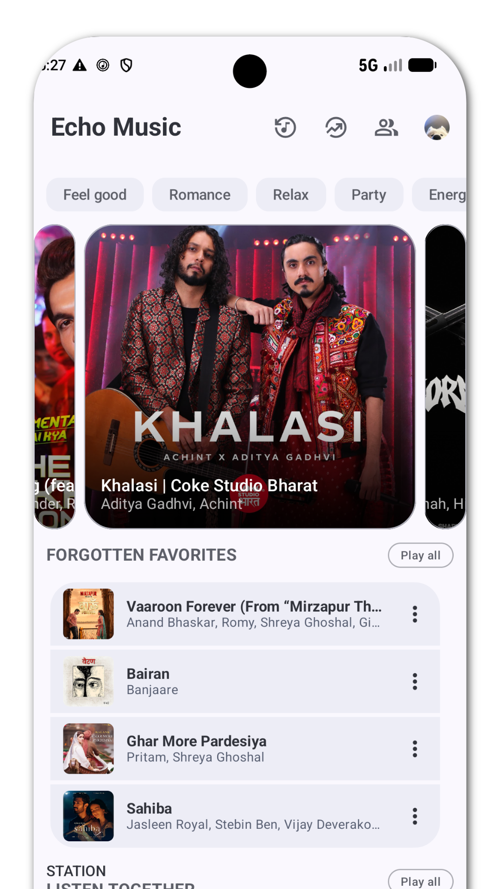
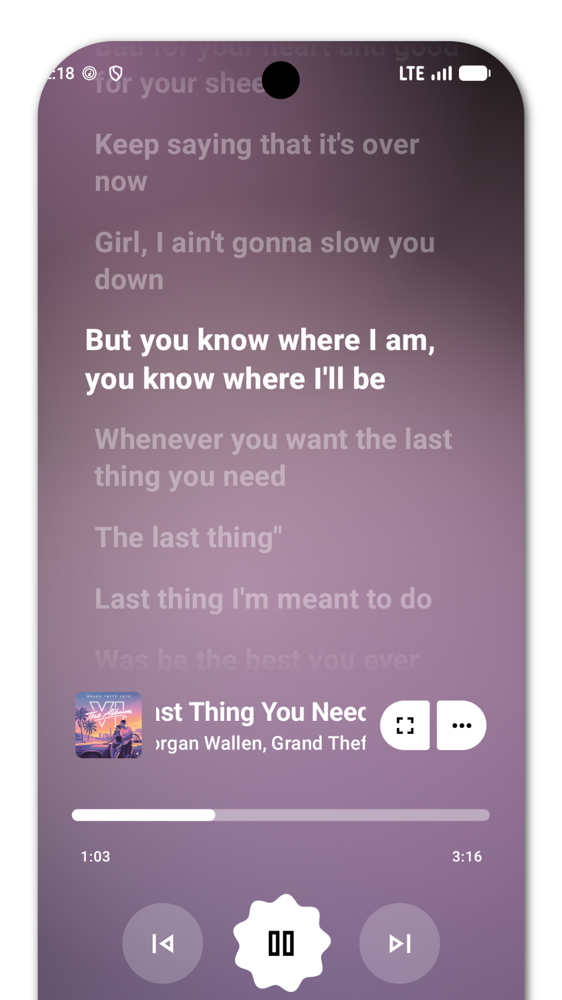

# Tuneify Music

<div align="center">
  <h1>🎵 Tuneify</h1>
  <p><b>Next-Generation High-Fidelity Music Streaming & Offline Audio Player for Android</b></p>
  <p><i>Crafted with Material Expressive 3, Obsidian Purple Dark Theme, and Crystal-Clear Acoustic Engines.</i></p>

  <p>
    <a href="https://github.com/Tuneify/Tuneify/releases"></a>
    <a href="LICENSE"></a>
    <a href="#"></a>
    <a href="#"></a>
  </p>
</div>

---

## 🌟 Overview

**Tuneify** is a standalone, ultra-modern Android music client engineered for audiophiles and design purists. Designed from the ground up with Jetpack Compose and Material Expressive 3 principles, Tuneify combines infinite ad-free streaming, synchronized lyrics, offline downloads, and an atmospheric Obsidian Purple dark interface.

Whether exploring trending chartbusters, streaming regional favorites, or enjoying local lossless tracks offline, Tuneify provides a fast, fluid, and responsive audio experience.

---

## ✨ Key Features

### 🎧 Pure & Uncompromised Playback
- **Ad-Free Streaming** — Listen to millions of tracks without interruptions.
- **High-Fidelity Audio** — Stream in high-bitrate Opus / AAC formats with dynamic stream decoding.
- **Offline Download Manager** — Download songs, albums, and entire playlists for offline listening.
- **Background & Lockscreen Controls** — Full media session controls with lockscreen artwork and quick actions.
- **Crossfade & Gapless Transitions** — Seamless track transitions without sudden silences.

### 🎨 Material Expressive 3 & Obsidian Aesthetic
- **Obsidian Purple Palette** — Deep, atmospheric dark theme tailored for OLED displays.
- **Atmospheric Feather Lighting** — Top-corner radial lighting with breathing ambient luminescence.
- **Spotlight Hero Carousel** — Wide curved cards with multi-stop gradients and quick-play actions.
- **YouTube Music 4-Track Column Carousels** — Browse Quick Picks, Top Charts, Trending Stations, and Late Night Chill in dense, fluid multi-row columns.
- **Cookie-Shape Artist Profiles** — Expressive 7-lobed geometric artist avatars with genuine singer channel imagery.

### 📜 Synchronized Lyrics & Smart Features
- **Real-Time Synchronized Lyrics** — Word-by-word and line-by-line synced lyrics with smooth GPU animations.
- **AI Translation** — Translate foreign lyrics into your local language instantly.
- **Spotify Fast Sync** — Import your Spotify playlists and library with one tap.
- **Audio Recognition** — Identify music playing in your physical environment.
- **Equalizer & Sound Customization** — Tailor bass boost, virtualizer, and custom frequency bands.

---

## 📱 Screenshots

<div align="center">
  <table style="margin: 0 auto; border-collapse: collapse; border: none;">
    <tr>
      <td align="center" style="padding: 10px; border: none;">
        <b>Home & Atmospheric Glow</b><br><br>
        
      </td>
      <td align="center" style="padding: 10px; border: none;">
        <b>Expressive Player</b><br><br>
        
      </td>
      <td align="center" style="padding: 10px; border: none;">
        <b>Synchronized Lyrics</b><br><br>
        
      </td>
    </tr>
  </table>
</div>

---

## 🛠️ Building & Installing

### System Requirements
- **Android Studio**: Ladybug / Meerkat or newer
- **JDK**: OpenJDK 17 or 21
- **Android SDK**: API Level 35 (Build-Tools 35.0.0)

### 1. Clone the Repository
```bash
git clone https://github.com/Tuneify/Tuneify.git
cd Tuneify
```

### 2. Configure Local SDK
Ensure your `local.properties` file has your Android SDK path:
```properties
sdk.dir=C:\\Users\\<YourUser>\\AppData\\Local\\Android\\Sdk
```

### 3. Build APK

#### Build Debug APK (For Testing):
```bash
# Optimized ARM64 architecture (Fastest for modern phones):
.\gradlew assembleArm64GmsDebug

# Universal variant:
.\gradlew assembleUniversalGmsDebug
```

#### Build Release APK (For Production / GitHub Release):
```bash
# Optimized ARM64 Release APK:
.\gradlew assembleArm64GmsRelease

# Universal Release APK:
.\gradlew assembleUniversalGmsRelease
```

The compiled release APK will be generated at:
```
app/build/outputs/apk/arm64Gms/release/app-arm64-gms-release-unsigned.apk
```
*(Or `app-universal-gms-release-unsigned.apk` for the universal variant).*

---

## 🚀 Creating a GitHub Release

1. **Tag the Release**:
   ```bash
   git tag -a v1.0.0 -m "Tuneify v1.0.0 Release"
   git push origin v1.0.0
   ```
2. **Publish on GitHub**:
   - Navigate to `Releases` -> `Draft a new release`.
   - Select tag `v1.0.0`.
   - Title: `Tuneify v1.0.0 - The Obsidian Launch`.
   - Attach the generated APK binary from `app/build/outputs/apk/arm64Gms/release/`.
   - Publish!

---

## 👤 Author & Contributor

- **Vivek** ([@Vivek](https://github.com/Vivek)) — *Creator, Lead Developer & UI Designer*

---

## 📄 License

Tuneify is licensed under the **GNU General Public License v3.0 (GPL-3.0)**. See the [LICENSE](LICENSE) file for more information.
